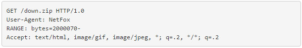
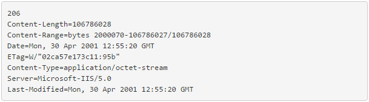

# netty

分片上传与断点续传之间没有很直接的关系

利用netty 写的上传和下载超大文件的demo

### 实战场景：
>
> 运维人员通过web应用操作服务器，从另一台公共web应用服务器下载超大文件到自己的服务器上
 
 

-------------------------------------------------------------------------------

# 断点续传

## 断点上传辨义

 在 Http 协议之下的 文件下载有“断点续传”功能，从服务器到客户端的文件下载可行，而对Http 协议的
文件上传则不同。 断点续传是基于 请求-响应 模式的文件传输方式，客户端通过记录不同数据流位置来实
现，还必须知道整个文件的大小才能实现断点续传。客户端保存传送状态是必要条件，无论是文件上传还是下载。 
对于象 FlashGet/NetAnt 这样的下载软件还提供了多线程并行下载的功能以提高下载速度。 对于上传文件，
服务器端不能主动进行请求（由于防火墙屏蔽），所以只能由客户端进行分段发送，而服务器端接收的结果也未
必能够反馈回客户端（在互联网中异常情况会随处出现），客户端无法知道服务器端接收了多少数据，只能整个
重发。所以断点上传这个概念是不可行的，分段/分组上传才是正解。 如果还不清楚请参照 《断点续传原理》

## 断点续传原理

> 所谓断点续传，也就是要从文件已经下载的地方开始继续下载。所以在客户端浏览器传给 Web服务器的时候要多
> 加一条信息–从哪里开始。 下面是用自己编的一个”浏览器”来传递请求信息给Web服务器，要求从2000070字节开始。
>
> 
>
> 仔细看一下就会发现多了一行RANGE: bytes=2000070- 这一行的意思就是告诉服务器down.zip这个文件从
> 2000070字节开始传，前面的字节不用传了。 服务器收到这个请求以后，返回的信息如下：
>
> 
> 
> 和前面服务器返回的信息比较一下，就会发现增加了一行： Content-Range=bytes 2000070-106786027/106786028 
> 返回的代码也改为206了，而不再是200了。 知道了以上原理，就可以进行断点续传的编程了。

## 分段上传

### 逻辑流程

大文件拆分 –> 发送传输计划(告知服务器以下这些片段是一个文件) 是否需要从服务器端申请一个文件ID,如果以文件 
Hash作为文件标识可以不用申请ID –> 分段发送并记录哪些片段是已经发送过的 –> 服务器分段接收 –>全部片段接收
完成 –> 组合成一个文件 –> 文件校验 –> 标记为已经完成 ，可以提供下载

### 如何分段

对于压缩文件 可以 按照单个文件进行发送，但是缺乏通用性，所以还是按照 统一的片段大小进行拆分。 拆分后如何
标记片段呢？通过计算 片段的 Hash 值 在客户端进行记录，这样即使客户端关机或软件退出，下次启动后仍然可以继
续上传。

### 分段的策略

文件分成几段是一个讲究策略的事情，根据网速/服务器端的负载情况，很难找到一个最优解，那么较优化的解决方法
还是有的。 分段的大小取决于网速和稳定性，另外Web服务器也存在一定的限制，如果没有权限修改 IIS 的配置，
那么就只能使用一个比较小的分段大小。 在局域网中传输 10M左右的文件不会占用太多的时间，用户真正关心的并不
是占用了多少流量而是用了多少时间，长时间停滞的上传进度会让人费解，无法知道后台在搞些什么。 而太过细碎的分
片又会造成带宽的浪费，和重复的响应等待。 比如 每段大小限制在1M以内，如果文件比较小，比如2M以内，就不必分段。

### 文件Hash

通过 计算Hash 的方法 可以唯一标识一个文件，如果文件内容在分段上传过程中发生变化，那么需要重新计算文件Hash，
同时服务器端会抛弃已接收到的内容，重新接收分段。 数据流的Hash 可以通过 MD5 或者 SHA1 进行计算，在 .Net 中
有现成的方法。 文件Hash 和 片段 Hash 可以对接收到的文件内容进行验证。所以客户端和服务器端需要相同的 Hash 方法。

文件比较和版本检查

对于一个大小超过 100M的文件来说，不会全部都有改变，整个文件重新发送会造成不必要的流量浪费。 为了减少不必要的流量
浪费，可以从服务器申请一个文件上传的Id，该ID 对应唯一的一个文件，如果文件发生变化，根据各个片段Hash 分析那一部分
发生了变化，重新发送变化的部分。文件片段全部传输完成后，发送整个文件的Hash供服务器进行校验进行片段合并。 如果文件
的变化发生在开始部分，哪怕只是增加了一个字节，也不可避免重新发送整个文件。这又涉及到另外一个论题，即《文件比较》 
rsync 文档中提到两种 Hash 的算法 rolling checksum(32bits)，md5 checksume(128bits)这里记录一下，以后可能会
有用。 问题 文件比较 参见 
[rsync unix 下文件同步的 核心算法](http://note.youdao.com/share/?id=c9d8c4e7ac36465bb8267b0a24cd95b6&type=note#/)

　
###
一般常说的断点续传是指文件下载的断点续传。 即利用HTTP协议中的Content-Range关键字(在HTTP Header中)，向服务器发请求，
服务器接收请求后，查看Content-Range属性的文件偏移量，从而发送后续文件二进制信息给浏览器。比如网络蚂蚁类的下载软件，
即开启多线程利用Content-Range关键字将某个网络资源分布接收，最终整合保存在本地。

而在WEB中我们所使用的上传文件断点续传功能，大多是需要下载ActiveX控件来实现。即相当于在本地下载了一个应用程序，同服务
器间文件传输协议也不用使用HTTP协议，可自定义协议完成。

  
